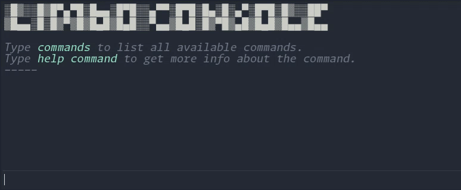

<p align="left">
  
</p>

---



[](https://github.com/limbonaut/limbo_console/blob/master/LICENSE.md)

A simple and easy-to-use in-game dev console with a command interpreter for Godot Engine 4.

It supports auto-completion with `TAB` for commands and history, auto-correction, inline hints and highlighting, command help text generation, argument parsing for basic types, aliases, custom theming, and more.

This plugin is currently in development, so expect breaking changes.

[](https://ko-fi.com/Y8Y2TCNH0)


## How to use

> 🛈 LimboConsole can be added as a Git submodule

Place the source code in the `res://addons/limbo_console/` directory, and enable this plugin in the project settings, then reload the project. Toggle the console with the `GRAVE ACCENT` key (aka backtick - the key to the left of the `1` key). This can be changed in the Input Map tab in the project settings.

Adding a new command is quite simple:

```gdscript
func _ready() -> void:
    LimboConsole.register_command(multiply)

func multiply(a: float, b: float) -> void:
    LimboConsole.info("a * b: " + str(a * b))
```

The example above adds a command that multiplies two numbers and prints the result (type `multiply 2 4`). Additionally, you can specify a name and a description:

```gdscript
LimboConsole.register_command(multiply, "multiply", "multiply two numbers")
```

Several basic types are supported for command arguments, such as `bool`, `int`, `float`, `String` and `Vector{2,3,4}` types. To enter a `Vector2` argument, enclose its components in parentheses, like this: `(1 2)`. String arguments can also be enclosed in double quotation marks `"`.

Autocompletion works for both command names and history. It can also be implemented for specific command arguments, as shown in the following example:
```gdscript
LimboConsole.register_command(teleport, "teleport", "teleport to site on this level")
LimboConsole.add_argument_autocomplete_source("teleport", 1,
        func(): return ["entrance", "caves", "boss"]
)
```
For a dynamically generated list of autocomplete values, the code could look like this:
```gdscript
LimboConsole.add_argument_autocomplete_source("teleport", 1,
        func(): return get_tree().get_nodes_in_group("teleportation_site").map(
                func(node): return node.name)
)
```

### Methods and properties

Some notable methods and properties:

- LimboConsole.enabled
- LimboConsole.register_command(callable, command_name, description)
- LimboConsole.unregister_command(callable_or_command_name)
- LimboConsole.add_alias(alias_name, command_name)
- LimboConsole.info(text_line)
- LimboConsole.error(text_line)
- LimboConsole.warning(text_line)
- LimboConsole.toggle_console()
- LimboConsole.add_argument_autocomplete_source(command_name, argument, callable)
- LimboConsole.execute_script(path, silent)

This is not a complete list. For the rest, check out `limbo_console.gd`.

### Configuration

Options can be modified in the project-specific configuration file located at `res://addons/limbo_console.cfg`. This file is stored outside the plugin's directory to support adding the plugin as a Git submodule.

LimboConsole also supports UI theming. Simply duplicate the `default_theme.tres` file and rename it to `limbo_console_theme.tres`. The file path is important - it should be located at `res://addons/limbo_console_theme.tres`. You can change this location in the config file.
Open the theme resource in Godot to customize it for your game. Console text colors can be adjusted in the `ConsoleColors` category.

### Scripting

You can execute simple scripts containing a sequence of commands:
```shell
exec lcs/my_script.lcs
```

Simple rules:
- Commands must be provided in the same syntax as in the prompt, with each command on a separate line.
- The script must exist at the specified path, either in the `res://` or `user://` directory.
- The script must have the `.lcs` extension, but when running the `exec` command, you can omit the extension in the command line.
- A line that starts with a '#' is treated as a comment and is not executed as part of the script.

You can have a script execute automatically every time the game starts. There is a special script called `user://autoexec.lcs` that runs each time the game starts. This can be customized in the configuration file.
